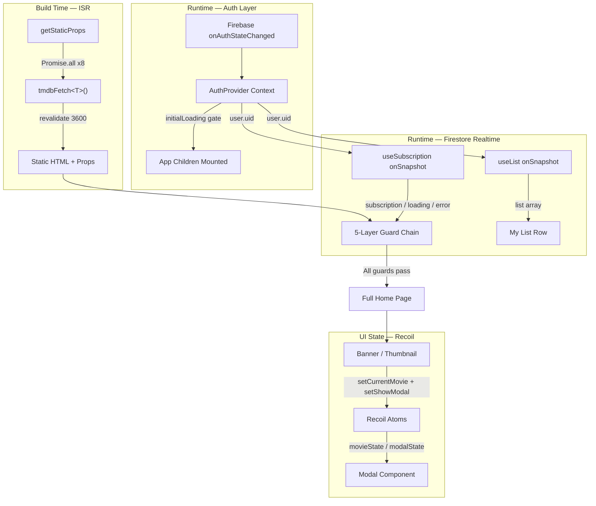

[English](README.md) | [繁體中文](README.zh-TW.md)

# TMDB Streaming Architecture — Production-Ready Reference Implementation

This repository is a technical reference implementation of a streaming media frontend architecture, focusing on resolving **asynchronous state dependency chains** and **complex edge cases**. It demonstrates how to design a **predictable, error-resilient, and highly defensive** state management system integrated across three distinct asynchronous streams: **Firebase Auth (Identity)**, **Stripe (Subscription/Payment)**, and **TMDB (Static Media Catalog)**.

- **Live Showcase**: [stream.tinahu.dev](https://stream.tinahu.dev/)
- **Test Credentials**: Email `demo@tinahu.dev` / Password `Demo1234!` (Includes Stripe test subscription permissions)

[](https://github.com/yuting813/TMDB-Streaming-Architecture/actions)


---

## Core Architecture & Engineering Decisions

### 1. Guarded Render Chain

In asynchronous data flows (e.g., Firestore queries can only be initiated after the Firebase Auth state is confirmed), using deep nested `if-else` blocks or combining all conditions into a single statement (e.g., `if (auth && sub && !loading)`) results in highly unmaintainable logic.

**Design Decision**: Discarded nested structures in favor of a strict **Early Return Guard Chain** (Guard Clauses) in `pages/index.tsx`. Each `if` layer acts as an independent security checkpoint, focusing exclusively on a single defensive boundary:

```tsx
// Layer 1 — Loading Guard: Full-screen Spinner if any data source is loading
if (authLoading || subscriptionLoading) return <Loader />;

// Layer 2 — Auth Guard: Block rendering for unauthenticated users
// (Redirect is handled by the onAuthStateChanged callback inside useAuth)
if (!user) return null;

// Layer 3 — Error Handling: Fallback UI for Firestore connection failures
if (subscriptionError) return <ErrorState />;

// Layer 4 — Permission Guard: Lock users without active subscriptions to the Plans page
if (!subscription) return <Plans products={products} />;

// Layer 5 — Mount the main core component after passing all guards
return <MainContent />;
```

The advantage: If new edge cases need to be added in the future, simply insert another `if` layer without risking regression bugs.

---

### 2. `initialLoading` — The Root Solution to FOUC

Firebase authentication relies on asynchronous callbacks. Before the SDK confirms the user's state, `user` temporarily resolves to `null`. If route guards are triggered at this exact moment, an already-logged-in user will experience a severe Flash of Unauthenticated Content (FOUC) from the "Login Page → Home Page".

**Design Decision**: Implemented a robust `initialLoading` timing lock within `useAuth`. Children rendering is forcibly intercepted until the first `onAuthStateChanged` callback confirmation is received:

```tsx
<AuthContext.Provider value={memoedValue}>
	{initialLoading ? <Loader /> : children}
</AuthContext.Provider>
```

---

### 3. API Defense Layer: The Three Lines of Defense for `tmdbFetch`

Direct usage of native `fetch()` within components is strictly prohibited. All network requests are routed through `utils/request.ts`, enforcing three major protections:

1. **Request Deduplication (In-flight Cache)**: `getStaticProps` runs 8 requests in parallel, and different routing pages may contain duplicate URLs. Using a module-level `Map<string, Promise>` cache, identical URLs return the exact same Promise instance, blocking duplicate traffic. If the Promise rejects, the cache entry is automatically cleared to allow retries.
2. **Build Hang Prevention (Timeout)**: An `AbortController` with an 8-second timeout is built-in to prevent unstable TMDB network conditions from causing Next.js builds to hang indefinitely.
3. **Safe Interruption Aggregation (`mergeAbortSignals`)**: Perfectly unifies "Network Timeout Events" and "Component Unmount Events". Firing an Abort from either side cleanly terminates the underlying `fetch`. After aborting, `removeEventListener` is synchronously executed to clear the listeners of both original signals, completely eradicating React Memory Leaks and dangling asynchronous callbacks. (Note: hand-rolled as a Safari polyfill — `AbortSignal.any()` is not supported in older Safari versions.)

---

### 4. Modal Race Condition Defense (Stale Response Ignore)

When a user rapidly clicks through the movie list, an old `fetch` result might arrive after a new Modal has already rendered, overwriting the state and causing UI corruption (Race Condition).

**Design Decision**: Utilized closure variables to track the component's mount lifecycle. If an old asynchronous result returns after the Modal has closed or switched, the stale payload is actively discarded, preventing React Memory Leak warnings and UI pollution caused by race conditions:

```tsx
let active = true;
async function fetchMovie() {
  const data = await tmdbFetch(...);
  if (!active) return; // Discard stale results upon component unmount to prevent state pollution
  setTrailer(key);
}
return () => { active = false; };
```

---

### 5. Dual-Track State Architecture: ISR + Firestore

The update frequencies of the movie list and user profile data are vastly different. Forcing them into the same data layer would lead to state decoupling. This project splits the data flow based on its characteristics:

| Track               | Mechanism                                              | Trigger Timing                           | Single Source of Truth (SSOT) |
| ------------------- | ------------------------------------------------------ | ---------------------------------------- | ----------------------------- |
| Movie Category Data | Next.js ISR (`getStaticProps` + `revalidate: 3600`)    | Build Time + Hourly background increment | TMDB API                      |
| User Profile Data   | Firestore `onSnapshot` (`useList` / `useSubscription`) | Real-time push on any DB change          | Firestore                     |

**Design Decision**: For the user's "My List", I abandoned the traditional approach of storing state in Redux/Recoil before asynchronously pushing it to the backend. Instead, Firestore is used directly as the SSOT. The component is only responsible for triggering writes and relies on `onSnapshot` to passively receive changes, completely eliminating the risk of state inconsistency caused by premature UI updates.

**Error Fallback**: The `catch` block in `getStaticProps` returns an empty array when a TMDB request fails and shortens the `revalidate` to 60 seconds, ensuring a quick rebuild retry after a build failure.

---

### 6. State Selection: Context vs. Recoil (Decoupling by Data Flow)

- **Auth (React Context)**: Authentication state is a top-of-the-tree dependency with a low mutation frequency. `useAuth` encapsulates the complete Firebase subscription lifecycle and automatic logout timer protection, using `useMemo` to block rendering noise.

- **UI State (Recoil Atom)**: Using Context for Banner, Thumbnail, and Modal would trigger large-scale, unnecessary re-renders. This system uses Recoil atoms as a lightweight Publish/Subscribe event bus, completely decoupling the components—clicking a Thumbnail simply calls `setCurrentMovie(movie)` without any Prop Drilling.

  **Write-Side Isolation**: `Thumbnail` utilizes `useSetRecoilState` (pure write setter) instead of `useRecoilState`. Because the Thumbnail only needs to dispatch state and never read it, `useSetRecoilState` ensures that none of the thumbnail components are registered as subscribers to the Recoil atom, completely eradicating the O(N) chain-rendering issue where "clicking any thumbnail causes all thumbnails on the screen to re-render simultaneously". The `Home` page itself also holds no references to `modalState`, ensuring page-level components are fully detached from the UI interaction state subscription chain.

---

## System Architecture Diagram



---

## Edge Case Handling & Quality Assurance

- **3-State Image Machine**: Every image component maintains three states—Loading (`animate-pulse` Skeleton to prevent CLS), Success (`opacity-100` fade-in to prevent flashing), and Failure (local fallback image to prevent broken links). `onError` simultaneously triggers `setIsLoaded(true)`, ensuring the skeleton instantly disappears once the fallback initiates. Implemented in both `Thumbnail.tsx` and `Modal.tsx`.
- **Immutable Route Whitelist**: `Object.freeze(['/login', ...])` ensures that the Auth guard's judgment criteria cannot be accidentally mutated. As a strict engineering discipline, this preemptively catches accidental mutations during development via TypeErrors, favoring "foolproofing" in our defensive design.
- **Jest Unit Testing**: Focused on `useSubscription`, utilizing Mock Firestore to test 6 boundary state machine transitions: `null user`, `empty list`, `onSnapshot error`, `loading`, `subscription active`, and `subscription inactive`, validating robustness under extreme scenarios.

---

## Project Structure

```
pages/          # Routing entry points (Keep logic minimal, delegate complexity to Hooks)
components/     # UI Presentation Layer (Does not handle direct API calls)
hooks/          # Defensive state management logic (useAuth / useSubscription / useList)
atoms/          # Atomic Recoil state
utils/          # API forwarding interface and network layer defense implementations
```

## Firestore Data Schema and Security Rules

### 1. Data Schema

```
customers/
  {uid}/
    subscriptions/
      {subscriptionId} → { status, current_period_start, current_period_end }
    myList/
      {movieId} → { id, title, poster_path, backdrop_path, ... }

products/
  {productId}/
    prices/
      {priceId} → { unit_amount, currency, interval }
```

### 2. Security Rules Design

This project configures read/write permissions based on functional requirements:

- **User Data Isolation**: `customers/{uid}` and its sub-collections are restricted to `request.auth.uid == uid`, ensuring only the authenticated owner can access their personal data.
- **Sensitive Data Read-Only**: User subscription (`subscriptions`) and payment (`payments`) records are set to **read-only** (`allow read`) on the client side. State updates must be processed securely on the backend via the Stripe Webhook (Stripe Firebase Extension), preventing client-side data tampering.
- **Public Catalog Read-Only**: Product metadata (`products/**`) is set to public read-only (`allow read: if true`), with write access strictly prohibited for all clients.

---

## Author & Engineering Philosophy

Drawing from a background in risk management and scenario anticipation, I focus on **Defensive Frontend Engineering** and building highly resilient codebases.

This reference implementation demonstrates how to apply these risk-mitigation principles to asynchronous web applications—utilizing loading lifecycles for media assets, Safari-compatible stream cancelations, and strict route guarding to protect the user experience against network degradation.

- **Website**: [tinahu.dev](https://www.tinahu.dev/)
- **GitHub**: [yuting813](https://github.com/yuting813)
- **Email**: [tinahuu321@gmail.com](mailto:tinahuu321@gmail.com)

> **Educational Use Disclaimer**
> This project is solely for personal technical demonstration and educational purposes. It is **NOT** a commercial product and is not affiliated with any streaming media service. All movie data is provided by the [TMDB API](https://www.themoviedb.org/).
