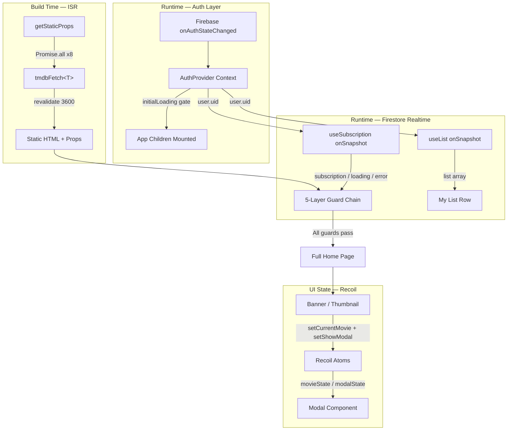

[English](README.md) | [繁體中文](README.zh-TW.md)

# TMDB Streaming Architecture — Frontend Engineering Portfolio

This is not a feature-showcase project. It is an architectural validation of **async state dependency chains** and **edge case handling** — demonstrating how to design a **predictable, fault-tolerant, and defensively architected** state management system across three concurrent async data streams: Firebase Auth, Stripe subscriptions, and TMDB static data.

- **Live Demo**: [stream.tinahu.dev](https://stream.tinahu.dev/)
- **Demo Account**: Email `demo@tinahu.dev` / Password `Demo1234!` (includes Stripe test subscription access)

---

## Architecture Decisions

### 1. Enforcing Single Source of Truth (SSOT): ISR + Firestore Dual Data Streams

Movie listings and user-specific data have fundamentally different update frequencies. Forcing them through the same data layer leads to state desync. This project deliberately splits them by characteristic:

| Stream              | Mechanism                                              | Trigger                                            | SSOT      |
| ------------------- | ------------------------------------------------------ | -------------------------------------------------- | --------- |
| Movie category data | Next.js ISR (`getStaticProps` + `revalidate: 3600`)    | Build time + hourly background revalidation        | TMDB API  |
| User personal data  | Firestore `onSnapshot` (`useList` / `useSubscription`) | Push-based: any DB write triggers immediate update | Firestore |

**Design decision**: For "My List", the conventional pattern of storing state in Redux/Recoil and then syncing to a backend was deliberately abandoned. Firestore is used directly as the SSOT. Components only trigger writes; UI state is derived passively from `onSnapshot`, eliminating the entire class of optimistic-update desync bugs.

**Error fallback**: The `getStaticProps` catch block returns empty arrays and shortens `revalidate` to 60 seconds on TMDB failure, ensuring failed builds trigger a rebuild retry as soon as possible.

---

### 2. 5-Layer Defensive Guard Chain

Firebase Auth confirmation is a prerequisite for Firestore queries — a natural waterfall dependency. A single compound `if` statement makes this logic unmaintainable and fragile.

**Design decision**: Implement a strict early-return chain in `pages/index.tsx`. Each layer owns exactly one defensive boundary:

```typescript
// Layer 1 — Loading guard: block render while any data source is loading
if (authLoading || subscriptionLoading) return <Loader />;

// Layer 2 — Auth guard: block unauthenticated mount
// (redirect handled by onAuthStateChanged callback inside useAuth)
if (!user) return null;

// Layer 3 — Error handling: Firestore connection failure fallback UI
if (subscriptionError) return <ErrorState />;

// Layer 4 — Permission guard: lock users without active subscription
if (!subscription) return <Plans products={products} />;

// Layer 5 — All guards passed: mount full application
return <MainContent />;
```

The advantage: adding a new boundary condition requires inserting one `if` — no risk of regression in existing layers.

---

### 3. `initialLoading` — Eliminating FOUC at the Root

Firebase Auth is asynchronous. Before the SDK confirms user state, `user` is momentarily `null`. If a route guard fires at this moment, authenticated users experience a jarring flash from the unauthenticated view to the home page (Flash of Unauthenticated Content, FOUC).

**Design decision**: Introduce an `initialLoading` timing lock in `useAuth`. Children are blocked from mounting until the first `onAuthStateChanged` callback resolves:

```typescript
<AuthContext.Provider value={memoedValue}>
  {!initialLoading && children}
</AuthContext.Provider>
```

---

### 4. State Library Selection: Context vs Recoil (Decoupled by Data Flow Direction)

- **Auth (React Context)**: Authentication state is a top-of-tree dependency with low change frequency. `useAuth` encapsulates the full Firebase subscription lifecycle and an auto-logout timer, with `useMemo` preventing unnecessary re-renders downstream.
- **UI State (Recoil Atoms)**: Using Context for Banner, Thumbnail, and Modal state would cause excessive re-renders across unrelated subtrees. Recoil atoms serve as a lightweight publish/subscribe event bus — a `Thumbnail` click only needs `setCurrentMovie(movie)`, with no prop drilling required.

  **Write-side isolation**: `Thumbnail` uses `useSetRecoilState` (setter-only) instead of `useRecoilState`. Because `Thumbnail` only needs to dispatch state — never read it — using `useSetRecoilState` prevents all visible thumbnails from being registered as atom subscribers. This eliminates the O(N) re-render cascade that would otherwise occur when any single thumbnail is clicked. The `Home` page itself also holds no reference to `modalState`, keeping page-level components entirely free from UI interaction subscriptions.

---

### 5. API Layer Defense: Three Lines of Protection in `tmdbFetch`

Direct `fetch()` calls inside components are prohibited. All network access is routed through `utils/request.ts`, which enforces three layers of protection:

1. **Request Deduplication (In-flight Cache)**: `getStaticProps` fires 8 parallel requests that may share duplicate URLs across route pages. A module-level `Map<string, Promise>` ensures identical URLs share a single Promise instance. On rejection, the entry is automatically cleared to allow retry.
2. **Build Hang Prevention (Timeout)**: A built-in `AbortController` enforces an 8-second timeout, preventing TMDB network instability from hanging the entire Next.js build indefinitely.
3. **Safe Signal Merging (`mergeAbortSignals`)**: Converges the network timeout abort event and the component unmount abort event. Either side triggering abort cleanly cancels the underlying `fetch`. After abort, `removeEventListener` cleans up both original signal listeners, eliminating React memory leaks and stale async callbacks.

---

### 6. Modal Race Condition Defense (Stale Result Cancellation)

When a user rapidly clicks between movies, a slow `fetch` from a previous selection may resolve after a newer Modal has already rendered, overwriting state with stale data.

**Design decision**: Cancellation Token Pattern gives each async operation the ability to self-invalidate:

```typescript
let active = true;
async function fetchMovie() {
  const data = await tmdbFetch(...);
  if (!active) return; // Discard stale result on unmount — prevents state corruption
  setTrailer(key);
}
return () => { active = false; };
```

---

## System Architecture Diagram



---

## Edge Case Handling & Quality Assurance

- **Image Three-State Machine**: Every image component manages three states — Loading (`animate-pulse` skeleton prevents CLS), Success (`opacity-100` fade-in prevents flash), and Error (local fallback image prevents broken image icons). `onError` simultaneously sets `isLoaded(true)` to ensure the skeleton is dismissed when the fallback activates. Implemented in both `Thumbnail.tsx` and `Modal.tsx`.
- **Immutable Route Whitelist**: `Object.freeze(['/login', ...])` ensures the auth guard's source of truth cannot be accidentally mutated at runtime by any module.
- **Jest Unit Tests**: Focused on `useSubscription` with Mock Firestore, covering 6 boundary state transitions: `null user`, `empty list`, `onSnapshot error`, `loading`, `subscription active`, and `subscription inactive`.

---

## Project Structure

```text
pages/          # Route entrypoints (kept minimal — complexity delegated to hooks)
components/     # Presentation layer (no direct API calls)
hooks/          # Defensive state management logic (useAuth / useSubscription / useList)
atoms/          # Recoil atomic state definitions
utils/          # API transport layer and network-level defense implementations
```

---

## About

Six years in procurement trained a sharp instinct for **risk anticipation** and **edge case identification**. Transitioning into frontend engineering, I've channeled that mindset into a pursuit of **Defensive Design**.

This project is the concrete expression of that approach: the three-state planning behind every image component, the abort logic on every `AbortSignal`, and the cache layer on every Promise chain — each reflects a core question I keep asking: _when the system is imperfect, how do we guarantee UI consistency?_

- **Website**: [tinahu.dev](https://www.tinahu.dev/)
- **GitHub**: [yuting813](https://github.com/yuting813)
- **Email**: [tinahuu321@gmail.com](mailto:tinahuu321@gmail.com)

> **Educational Disclaimer**
> This project is for personal technical demonstration and educational purposes only. It is **not** a commercial product. All movie data is sourced from the [TMDB API](https://www.themoviedb.org/).
