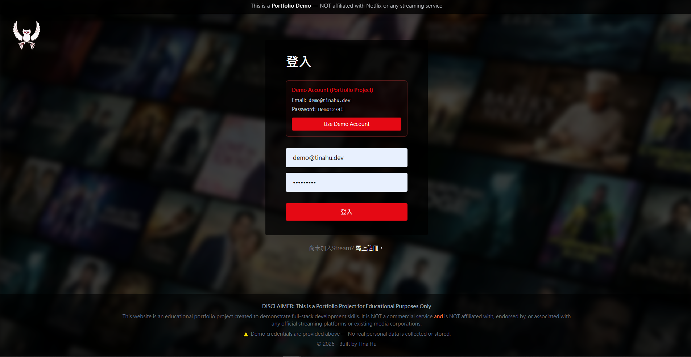
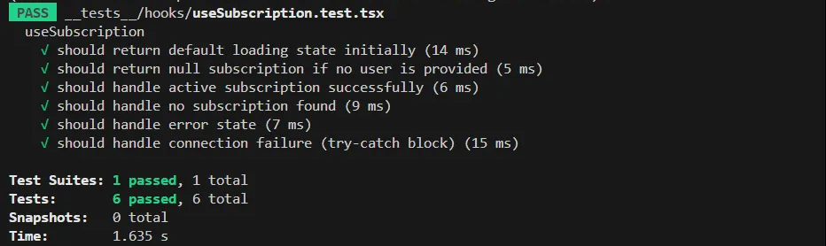

[English](README.md) | [繁體中文](README.zh-TW.md)

# TMDB Streaming Architecture - Frontend Engineering Portfolio

這是一個以 Next.js 與 TypeScript 開發的 TMDB 串流架構演示網站。本專案核心目標在於實踐 UI 架構設計、狀態可預測性、UX 邊界情境處理與網頁可及性 (A11y)，而不僅是功能堆疊。

- **Live Demo**: [stream.tinahu.dev](https://stream.tinahu.dev/)
- **Demo 帳號**：
  - Email: `demo@tinahu.dev`
  - Password: `Demo1234!` (內含 Stripe 測試訂閱權限)

---

## 為什麼做這個專案

此專案刻意模擬真實企業前端工程場景，解決以下核心問題：

- **狀態與路由保護**：處理 Auth 與訂閱狀態的依賴關係。
- **權限驅動 UI**：訂閱狀態對內容存取權限的即時影響。
- **資料強健性**：處理外部 API (TMDB) 資料不完整或延遲的情境。
- **工程可解釋性**：建立易於說明、擴充且型別嚴謹的前端結構。

---

## 核心技術挑戰與決策 (Engineering Challenges & Decisions)

### 1. 訂閱狀態與 UI 的強健同步 (Subscription-driven UI Stability)

- **挑戰**：Firebase Auth 與 Stripe 訂閱資料是異步加載的。若處理不當，使用者在登入後可能看到瞬時閃爍或權限不匹配（先看到付費內容隨後被踢出）。
- **對策**：設計了 `useSubscription` Hook 作為單一真理來源，並結合 Recoil 全域狀態。在資料尚未完全同步前，透過 Skeleton Screen 佔位，直到確認權限後才渲染內容。
- **成果**：解決了 Race Condition 導致的 UI 閃爍問題，提升使用者對平台的信任感。

### 2. 混合渲染策略與效能優化 (Hybrid Rendering Strategy & Performance)

- **挑戰**：影音平台需要兼顧 SEO (讓電影能被搜尋) 與流暢的換頁體驗。傳統 CSR (Client-Side Rendering) 在 SEO 與首屏載入速度 (FCP) 上表現不佳。
- **對策**：利用 Next.js 的 **ISR (`getStaticProps` + `revalidate`)** 在建置時預先渲染 HTML，並在背景定期更新資料，確保 SEO 且提供比 SSR 更快的回應速度。同時針對圖片密集區域實作 Lazy Loading。
- **成果**：確保搜尋引擎能正確爬取內容，並大幅降低 LCP (Largest Contentful Paint) 時間，讓使用者能瞬間看到首屏內容。

### 3. 極致的 UX 邊界情境處理

- **對策**：針對圖片載入失敗、網路延遲等邊界情況，實作了完整的 Fallback UI (如預設佔位圖)。利用 Next.js Image Component 優化 CLS (Cumulative Layout Shift)，防止圖片載入時造成的版面跳動。

---

## 主要功能

- **安全驗證**：註冊 / 登入 / 跨分頁狀態感知 (Firebase Auth)。
- **支付整合**：訂閱流建立與權限即時控管 (Stripe Checkout + Firestore)。
- **影音體驗**：動態隨機 Hero Banner、分類橫向捲軸列。
- **影片詳情**：異步資料加載與 YouTube 預告片嵌入。
- **我的清單**：即時新增/移除清單，並與資料庫同步。

---

### 安全與合規的驗證介面 (Secure & Compliant Authentication UI)

設計了明確的標示與警語，以區隔商業平台，確保符合安全規範。


---

## 技術棧

- **Framework**: Next.js (Pages Router), React
- **Language**: TypeScript (型別優先設計)
- **Form Handling**: React Hook Form (高效表單驗證)
- **UI Library**: Material UI (複雜互動元件整合)
- **Styling**: Tailwind CSS
- **State**: Recoil (原子化狀態管理)
- **Testing**: Jest, React Testing Library (Unit Testing)
- **Auth/Backend**: Firebase Auth, Firestore
- **Payments**: Stripe SDK
- **External API**: TMDB API

---

## 專案結構與設計原則

本專案採用 Next.js 的標準目錄結構，並結合關注點分離 (Separation of Concerns) 原則進行模組化開發：

```text
pages/          # Next.js 路由系統與各頁面入口
components/     # UI 元件 (分為單一功能元件與複合型佈局元件)
hooks/          # 封裝複雜商業邏輯 (如 useSubscription, useAuth)
atoms/          # Recoil 全域狀態定義 (如 Modal 顯示狀態)
lib/            # 外部服務實例化配置 (Stripe, Firebase)
utils/          # 封裝 API Helpers 與 Typed Fetching 邏輯
constants/      # 管理全域常數與第三方 API 設定 (如 TMDB 配置)
types/          # 全域 TypeScript 型別與 Interface 定義
```

- **UI 元件保持 Pure**：元件不直接呼叫 API，僅負責渲染，確保 View 層乾淨且無 Side Effects。
- **商業邏輯與 UI 分離**：將 Firebase 監聽、Stripe 訂閱判斷等邏輯抽離至自定義 Hooks 中，提升代碼可維護性。
- **型別驅動開發 (Type-safe API Fetching)**：利用 TypeScript 嚴格定義 API Response 型別，在 Utils 層進行處理，大幅降低執行期錯誤。
- **全域狀態原子化**：透過 Recoil 實作原子化狀態管理，僅針對跨元件共享的 UI 狀態進行管理，避免過度渲染並維持效能。
- **型別安全性**：全面定義 Interface，禁止 `any` 型別擴散，確保代碼結構嚴謹。

---

## 品質保證 (Quality Assurance)

- **CI/CD**: 串接 Vercel 自動化部署流程。
- **Testing**: 針對核心 Hook (如 useSubscription) 實作 Jest 單元測試，確保邊界狀況 (Loading/Error) 處理正確。
  
  \*(截圖：單元測試全數通過，包含多種邊界情境覆蓋)

- **Code Quality**: 設定 Husky Pre-commit hook，強制執行 ESLint 與 Prettier 檢驗，確保程式碼品質與風格一致。

---

### Getting Started

#### 1. 複製專案

```bash
git clone https://github.com/yuting813/TMDB-Streaming-Architecture.git
cd TMDB-Streaming-Architecture
```

#### 2. 安裝依賴

```bash
npm install
```

#### 3. 設定環境變數 (請參考 .env.example)

```bash
cp .env.example .env.local
```

#### 4. 啟動開發伺服器

```bash
npm run dev
```

#### 5. 執行單元測試

```bash
npm run test
```

---

## 關於我

這個專案展示了我如何將6年採購職涯培養的嚴謹邏輯與風險控管思維，轉化為前端開發中的系統化思考，確保專案不僅具備功能，更具備高度的預測性與架構穩定性。

- **Email**: tinahuu321@gmail.com
- **LinkedIn**: [Tina Hu](https://www.linkedin.com/in/tina-hu-frontend)
- **GitHub**: [yuting813](https://github.com/yuting813)

註：此專案為個人學習與職涯轉換期間完成，著重於工程設計與架構可解釋性。

> **教育用途免責聲明**
> 本專案僅供個人作品集展示與教育用途，**非**商業產品，且與 Netflix 或任何串流媒體服務無關。所有電影資料皆來自 [TMDB API](https://www.themoviedb.org/)。
