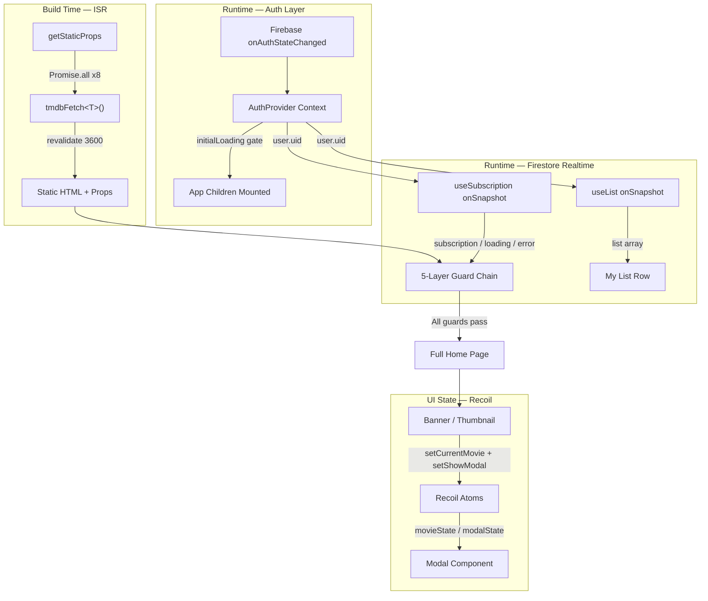

[English](README.md) | [繁體中文](README.zh-TW.md)

# TMDB Streaming Architecture — Frontend Engineering Portfolio

這不是一個單純的「功能展示」專案。它是一個針對「非同步狀態依賴鏈」與「邊界極端情境（Edge Cases）」的工程架構驗證：展示如何在 **Firebase Auth（身份狀態）**、**Stripe（金流訂閱）** 與 **TMDB（靜態資料）** 這三條非同步資料流之間，設計出 **可預測、防呆且具備高度防禦性（Defensive Design）** 的狀態管理系統。

- **Live Demo**: [stream.tinahu.dev](https://stream.tinahu.dev/)
- **Demo 帳號**：Email `demo@tinahu.dev` / Password `Demo1234!`（含 Stripe 測試訂閱權限）

---

## 核心架構與工程決策 (Architecture Decisions)

### 1. Guarded Render Chain（防禦性渲染鏈）

Firebase Auth 狀態確認後，才能啟動 Firestore 查詢——這是一個天然的瀑布依賴（Waterfall Dependency）。若使用單一複雜的 `if` 判斷式，將導致邏輯難以維護。

**設計決策**：在 `pages/index.tsx` 中實作嚴格的 early return 鏈，每層只專注一個防禦邊界：

```tsx
// 第 1 層 — Loading 防護：任一資料來源載入中，全螢幕 Spinner
if (authLoading || subscriptionLoading) return <Loader />;

// 第 2 層 — Auth 防護：未登入者阻擋掛載
// （redirect 由 useAuth 內部的 onAuthStateChanged callback 負責執行）
if (!user) return null;

// 第 3 層 — 錯誤處理：Firestore 連線異常的 fallback UI
if (subscriptionError) return <ErrorState />;

// 第 4 層 — 權限防護：無有效訂閱者，鎖定於訂閱方案頁
if (!subscription) return <Plans products={products} />;

// 第 5 層 — 全部通過後掛載主核心元件
return <MainContent />;
```

優勢在於：未來若需新增邊界情境，只需插入一層 `if` 即可，不會引發回歸錯誤（Regression Bug）。

---

### 2. `initialLoading` — FOUC 與畫面閃動的根本解法

Firebase 驗證為非同步回調。在 SDK 確認使用者狀態前，`user` 會暫時呈現 `null`。若此時觸發路由守衛，已登入的用戶會經歷「未登入畫面 → 首頁」的嚴重閃動（Flash of Unauthenticated Content, FOUC）。

**設計決策**：在 `useAuth` 實作堅固的 `initialLoading` 時序鎖。在第一次 `onAuthStateChanged` 回調確認前，強制攔截 children 渲染：

```tsx
<AuthContext.Provider value={memoedValue}>
	{initialLoading ? <Loader /> : children}
</AuthContext.Provider>
```

---

### 3. API Defense Layer（請求防禦層）：`tmdbFetch` 的三道防線

嚴禁在元件內直接呼叫原生 `fetch()`。所有網路請求統一透過 `utils/request.ts` 轉發，並落實三大防護：

1. **請求去重（Request Deduplication / In-flight Cache）**：`getStaticProps` 並行 8 個請求，不同路由頁面間可能含有重複 URL。透過模組級別的 `Map<string, Promise>` 快取，相同 URL 返回同一個 Promise 實體，阻斷重複流量。Promise reject 時自動清除 cache entry，允許重試。
2. **Build 卡死防護（Timeout）**：內建 `AbortController` 賦予 8 秒 timeout，避免 TMDB 網路不穩導致 Next.js build 無限掛起。
3. **安全的中斷聚合（`mergeAbortSignals`）**：完美收斂「網路 Timeout 事件」與「Component 卸載事件」。任何一方發送 Abort 皆可乾淨砍斷底層 `fetch`；abort 後同步執行 `removeEventListener` 清除兩個原始 signal 的監聽器，根除 React Memory Leak 與懸空非同步回調。（手刻實作，作為 Safari 的 polyfill——較舊的 Safari 版本不支援 `AbortSignal.any()`。）

---

### 4. Modal 的競態條件防禦（Stale Result Cancellation）

當使用者在影片列表快速連點時，舊的 `fetch` 結果可能在新的 Modal 已渲染後才回來，進而覆蓋狀態造成畫面錯亂（Race Condition）。

**設計決策**：結合 Cancellation Token Pattern，讓非同步請求具備自我失效的判斷能力：

```typescript
let active = true;
async function fetchMovie() {
  const data = await tmdbFetch(...);
  if (!active) return; // 元件卸載時丟棄 stale 結果，防止狀態污染
  setTrailer(key);
}
return () => { active = false; };
```

---

### 5. Dual-Track State Architecture（雙軌狀態架構）：ISR + Firestore

電影清單與用戶個人資料的更新頻率截然不同，強制混用同一個資料層將導致狀態脫鉤。本專案將資料流依據特性拆分：

| 軌道         | 機制                                                   | 觸發時機                          | Single Source of Truth (SSOT) |
| ------------ | ------------------------------------------------------ | --------------------------------- | ----------------------------- |
| 電影分類資料 | Next.js ISR (`getStaticProps` + `revalidate: 3600`)    | Build Time + 每小時背景增量       | TMDB API                      |
| 用戶個人資料 | Firestore `onSnapshot` (`useList` / `useSubscription`) | 任何 DB 變化即時推送 (Push-based) | Firestore                     |

**設計決策**：針對使用者的「我的片單」，捨棄將狀態儲存於 Redux/Recoil 後再非同步推上後端的傳統作法，改將 Firestore 直接當作 SSOT。元件僅負責觸發寫入，並依賴 `onSnapshot` 被動接收變化，徹底杜絕了 UI 先行導致的狀態不一致風險。

**錯誤 Fallback**：`getStaticProps` 的 catch 區塊在 TMDB 請求失敗時會回傳空陣列，並縮短 `revalidate` 至 60 秒，確保 build 失敗後盡快觸發重建重試。

---

### 6. 狀態選型：Context vs Recoil（按資料流向解耦）

- **Auth (React Context)**：認證狀態是樹頂端的依賴，變更頻率低。`useAuth` 封裝完整的 Firebase 訂閱生命週期與自動登出計時器防護，並用 `useMemo` 阻擋渲染噪音。

- **UI 狀態 (Recoil Atom)**：Banner、Thumbnail 與 Modal 若使用 Context 會引發大範圍的不必要重渲染。本系統使用 Recoil atom 作為輕量的發布/訂閱（Publish/Subscribe）事件匯流排，讓元件完全解耦——Thumbnail 點擊後僅需 `setCurrentMovie(movie)`，無需任何 Prop Drilling。

  **寫入端隔離**：`Thumbnail` 採用 `useSetRecoilState`（純寫入 Setter）而非 `useRecoilState`。因為 Thumbnail 只需要發送狀態、從不讀取，使用 `useSetRecoilState` 可確保所有縮圖元件都不會被登記為 Recoil atom 的訂閱者，徹底消除「點擊任意縮圖導致畫面上所有縮圖一同重渲染」的 O(N) 連鎖渲染問題。`Home` 頁面本身也不持有任何 `modalState` 的參照，確保頁面層級元件完全脫離 UI 互動狀態的訂閱鏈。

---

## 系統架構圖


```mermaid
graph TD
    subgraph "Build Time — ISR"
        A[getStaticProps] -->|Promise.all x8| B["tmdbFetch&lt;T&gt;()"]
        B -->|revalidate 3600| C[Static HTML + Props]
    end

    subgraph "Runtime — Auth Layer"
        D[Firebase onAuthStateChanged] --> E[AuthProvider Context]
        E -->|initialLoading gate| F[App Children Mounted]
    end

    subgraph "Runtime — Firestore Realtime"
        E -->|user.uid| G[useSubscription onSnapshot]
        E -->|user.uid| H[useList onSnapshot]
        G -->|subscription / loading / error| I[5-Layer Guard Chain]
        H -->|list array| J[My List Row]
    end

    subgraph "UI State — Recoil"
        K[Banner / Thumbnail] -->|setCurrentMovie + setShowModal| L[Recoil Atoms]
        L -->|movieState / modalState| M[Modal Component]
    end

    C --> I
    I -->|All guards pass| N[Full Home Page]
    N --> K
```

---

## 邊界狀態處理與品質保證

- **圖片三態狀態機**：每個圖片元件維護三態——載入中（`animate-pulse` Skeleton 防止 CLS）、成功（`opacity-100` 淡入防閃跳）、失敗（本地 fallback 圖片防破圖）。`onError` 同時觸發 `setIsLoaded(true)`，確保 fallback 啟動後 skeleton 即時消失。`Thumbnail.tsx` 與 `Modal.tsx` 均有實作。
- **不可變的路由白名單**：`Object.freeze(['/login', ...])` 確保 Auth 守衛的判斷基準在執行期不會被任何模組意外篡改。
- **Jest 單元測試**：聚焦 `useSubscription`，使用 Mock Firestore 測試 6 種邊界狀態機切換：`null user`、`empty list`、`onSnapshot error`、`loading`、`subscription active`、`subscription inactive`，驗證極端情境下的強韌度。

---

## 專案結構

```
pages/          # 路由入口（保持邏輯極簡化，將複雜度委派至 Hooks）
components/     # UI 呈現層（不處理 API 直接呼叫）
hooks/          # 防禦性狀態管理邏輯（useAuth / useSubscription / useList）
atoms/          # 原子化 Recoil 狀態
utils/          # API 轉發介面與網路層防禦實作
```

## Firestore 資料結構與安全規則

### 1. 資料模型
```
customers/
  {uid}/
    subscriptions/
      {subscriptionId} → { status, current_period_start, current_period_end }
    myList/
      {movieId} → { id, title, poster_path, backdrop_path, ... }

products/
  {productId}/
    prices/
      {priceId} → { unit_amount, currency, interval }
```

### 2. 安全規則 (Security Rules) 設計
本專案的 `firestore.rules` 依功能需求區分讀寫權限：

* **用戶資料隔離**：`customers/{uid}` 及其子集合限制為 `request.auth.uid == uid`，僅允許持有對應憑證的登入用戶本人進行存取。
* **敏感資料唯讀**：用戶的訂閱記錄（`subscriptions`）與付款記錄（`payments`）在安全規則中僅開放 `read` 權限。用戶端無法直接變更訂閱狀態，狀態更新需經由 Stripe Webhook (Stripe Firebase Extension) 於後端處理，防範前端資料篡改。
* **公開方案唯讀**：方案元資料（`products/**`）設為公開可讀（`allow read: if true`），且禁止任何用戶端寫入。

---

## 關於我

過去 6 年的採購職涯，訓練出了對「風險控管」與「極端狀況預判」的高度敏感性。在轉職前端工程師的過程中，我將這份思維轉化為對**防禦性工程設計（Defensive Design）**的追求。

這個專案正是這種思維的具象化：每一個元件的三態規劃、每一條 AbortSignal 的中斷邏輯，以及每一層 Promise 請求的緩存，都體現了我對於「當系統不完美時，我們如何保證 UI 一致性」的深度考量。

- **Website**: [tinahu.dev](https://www.tinahu.dev/)
- **GitHub**: [yuting813](https://github.com/yuting813)
- **Email**: [tinahuu321@gmail.com](mailto:tinahuu321@gmail.com)

> **教育用途免責聲明**
> 本專案僅供個人技術證明與教育用途，**非**商業產品，且與任何串流媒體服務無關。電影資料皆來自 [TMDB API](https://www.themoviedb.org/)
